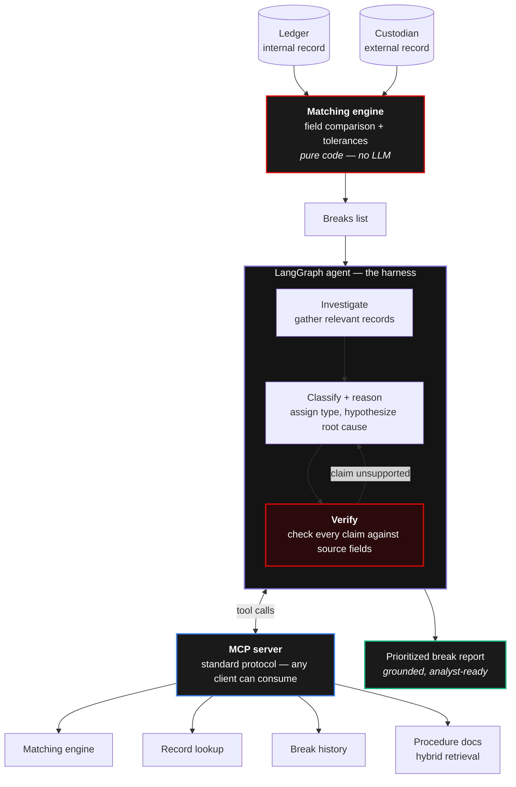

# TradeMatch

**A hallucination-proof trade reconciliation agent.** Code finds the discrepancies; the agent explains them and decides which ones a human should care about — and every explanation is verified against source data before it surfaces.

> **Status:** in active development. Day 1 of 9 complete (synthetic data generation). See [Build progress](#build-progress).

---

## Why this project

In February 2026, Goldman Sachs CIO Marco Argenti described spending six months with embedded Anthropic engineers building autonomous agents for two workflows: **accounting for trades and transactions**, and client vetting/onboarding. The stated goal was to collapse the time these functions take — including resolving trade reconciliation issues faster.

TradeMatch is an independent, from-scratch exploration of that idea, built on synthetic data to learn how such a system actually works.

> This project is **inspired by a public interview**. It is not affiliated with, endorsed by, or derived from any Goldman Sachs system. All data is synthetic and generated by the code in this repository.

---

## The problem

When a trade happens, two systems independently record it: the firm's **internal ledger** and the **custodian's** external record. These are not copies of each other — they are two separate witnesses to the same event, which means either can be wrong.

Reconciliation compares them field by field. Mismatches are called **breaks**. A human analyst then investigates each break to find the root cause and clear it. That investigation is the expensive part, and it is what agents aim to accelerate.

The move to **T+1 settlement** turned reconciliation into a same-day control — the old multi-day buffer to investigate breaks is gone, so speed now matters more than it used to.

### Break taxonomy

| Type | What differs | Usually a real error? |
|---|---|---|
| `timing` | `settlement_date` differs by 1–2 business days | **No** — the two systems booked it on different days |
| `price` | `price` (and `gross_amount`) differ | Yes |
| `quantity` | `quantity` (and `gross_amount`) differ | Yes |
| `missing` | Trade present in one system, absent in the other | Yes |
| `duplicate` | Same trade booked twice in one system | Yes |

The `timing` row is the crux of the whole project. The *field difference looks identical* to a real settlement failure, but one is benign and the other is urgent. Telling them apart requires judgment, not rules — which is precisely what justifies using an agent at all.

---

## Architecture

The core design decision: **deterministic code does the matching, the agent only handles breaks.**



**Reading the diagram:** the MCP server is a clean seam between the reasoning half (agent) and the deterministic half (tools). The agent never touches raw trade files for matching — code does that first and hands over only the breaks. The `verify` node loops back on failure: an unsupported claim is regenerated, not passed through.

### Why this split

| | Deterministic code | Agent |
|---|---|---|
| **Does** | Field comparison, tolerances, arithmetic | Judgment, classification, root-cause explanation |
| **Why** | Perfect, instant, cheap, identical every run | Weighs context that rules cannot encode |

Using an LLM to compare two numbers would be slower, costlier, and *less* reliable. Most failed agent projects fail by putting too much on the LLM side of this line.

### What the agent adds that code cannot

1. **Distinguishes benign from real** — a one-day settlement gap is either a timing artifact or a settlement failure. The field difference is identical; the context is not.
2. **Produces the explanation, not just the flag** — code says `price differs: 362.28 vs 380.21`. The analyst still needs *why*. Writing that root cause is the labor being automated.
3. **Synthesizes across sources** — pulls the record, checks counterparty history, consults procedure docs. Multi-step tool use where the plan depends on earlier results.
4. **Handles the long tail** — rules engines cover the 20 patterns you anticipated; real operations is a long tail of one-offs.

---

## Hallucination-proofing

A finance agent that *invents* a reason for a break is worse than useless — it is a compliance risk. Verification is not a bolt-on here; it is the point.

The verification node checks every claim in the agent's explanation against the actual trade fields. Unsupported claims are rejected and regenerated.

Critically, the agent must be able to say **"these disagree, and I cannot determine which is correct from the available evidence"** — and that counts as a *correct* answer. When two records disagree on price, the data alone often cannot tell you which side is right; resolving it requires evidence outside both records (the trade confirmation, exchange execution report, market data). An agent that always produces a confident root cause is an agent that fabricates. Verification's real job is enforcing that **confidence stays proportional to evidence**.

---

## Data

All data is synthetic, generated by `src/tradematch/data_generation/generate.py`.

```
data/
├── ledger.csv           # firm's internal record
├── custodian.csv        # external record
└── break_manifest.json  # ground-truth answer key
```

**Either side can be wrong.** The generator holds a set of true trades, then for each planted break picks a side — ledger *or* custodian — and corrupts that side away from truth. A generator that only ever corrupted the custodian would teach the agent a shortcut that does not exist in reality.

**The manifest is evaluation-only ground truth.** It records which side was corrupted and what the true value was. The agent must never see it — at runtime the agent sees two disagreeing records and no oracle. The manifest exists so that Day 7's evaluation can score whether the agent caught and classified each break correctly.

Matching is keyed on **CUSIP**, not ticker. A CUSIP is a permanent 9-character security identifier; tickers get reused and reassigned. Keying on a human-facing label would manufacture phantom breaks out of reference-data drift.

### Running the generator

```bash
python3 src/tradematch/data_generation/generate.py
```

No dependencies — standard library only. Seed is fixed at `42`.

```
ledger rows     : 194
custodian rows  : 197
breaks planted  : 30
by type         : {'missing': 11, 'timing': 10, 'price': 1, 'quantity': 6, 'duplicate': 2}
corrupted side  : {'custodian': 15, 'ledger': 15}
```

Row counts derive from the manifest: ledger `200 − 6 missing + 0 duplicate = 194`, custodian `200 − 5 missing + 2 duplicate = 197`.

---

## Build progress

| Day | Component | Status |
|---|---|---|
| 1 | Scaffold + synthetic data generator | ✅ Complete |
| 2 | Deterministic matching engine | Next |
| 3 | Tools wrapped as an MCP server | Planned |
| 4 | LangGraph agent consuming MCP | Planned |
| 5 | Break investigation + classification | Planned |
| 6 | Self-verification layer | Planned |
| 7 | Observability + agent evaluation | Planned |
| 8 | Agentic RAG over procedure docs | Planned |
| 9+ | Cross-break pattern memory *(stretch)* | Planned |

---

## Known limitations

Kept deliberately honest.

- **Break type distribution is lumpy.** Types are drawn independently, so 30 draws cluster — the current run has only 1 price break. Needs stratified sampling before the Day 7 evaluation, or per-type accuracy cannot be measured meaningfully.
- **No authority hierarchy.** Real firms encode which side is authoritative per field (custodian for positions, firm for execution details). TradeMatch treats both sides as equally credible, which is a simplification.
- **Tolerances are not yet implemented.** Day 2 work.
- **Synthetic data is cleaner than reality.** Real feeds bring encoding issues, partial fills, corporate actions, and multi-currency complications that this generator does not model.

---

## Stack

Python 3.12 · LangGraph · MCP · Pydantic · Langfuse

---

## Project structure

```
tradematch/
├── data/                              # generated data (git-ignored in practice)
├── src/tradematch/
│   ├── __init__.py
│   └── data_generation/
│       ├── __init__.py
│       └── generate.py                # synthetic trade + break generator
├── tests/
└── README.md
```